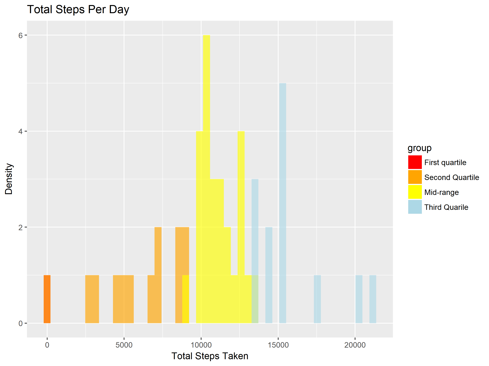

## Loading and preprocessing the data

```r
# Get he current working directory
wd <- getwd();
# Extract the data set if the data set folder does not exists
if(!dir.exists(file.path(wd, 'activity'))){
  zip <- paste(wd, 'activity.zip', sep = '/');
  outDir <- paste(wd, 'activity', sep = '/');
  unzip(zip,exdir=outDir)
}

# Read the data set
ds <- read.csv2('activity/activity.csv', sep = ',')
```


## What is mean total number of steps taken per day?

```r
# Find all Na rows in ds$steps
x <- is.na(ds$steps)
# Remove the NA rows and store the new data.frame as df
df <- ds[!x,]
# Load dplyr for the summary stats
library(dplyr)
```

```
## 
## Attaching package: 'dplyr'
```

```
## The following objects are masked from 'package:stats':
## 
##     filter, lag
```

```
## The following objects are masked from 'package:base':
## 
##     intersect, setdiff, setequal, union
```

```r
# Use piping to create a new data.frame with all the daily steps grouped by say
sums <- df %>% group_by(date) %>%
        summarise(total.steps = sum(steps), mean.steps = mean(steps),
                  median.steps = median(steps))

library(ggplot2)

# Find the quantiles
cols <- quantile(sums$total.steps)

# Create quantile groups
sums$group <- ifelse(sums$total.steps <= cols[1], 'a',
                     ifelse(sums$total.steps <= cols[2], 'b',
                            ifelse(sums$total.steps <= cols[4], 'c', 
                                   ifelse(sums$total.steps <= cols[5], 
                                          'd', 'e'))))
# Set a variable to store the alpha value
a = 0.65
# Create a histogram of the total steps per day, coloured by quantile group
hg <- ggplot(sums, aes(x = total.steps)) + 
  geom_histogram(binwidth = 450, data = subset(sums, group == 'a'), alpha = a,
                 aes(fill = group)) +
  geom_histogram(binwidth = 450, data = subset(sums, group == 'b'), alpha = a,
                 aes(fill = group))+
  geom_histogram(binwidth = 450, data = subset(sums, group == 'c'), alpha = a,
                 aes(fill = group))+
  geom_histogram(binwidth = 450, data = subset(sums, group == 'd'), alpha = a,
                 aes(fill = group)) +
  geom_histogram(binwidth = 450, data = subset(sums, group == 'e'), alpha = a,
                 aes(fill = group)) +
  ggtitle('Total Steps Per Day') + xlab('Total Steps Taken') + ylab('Density')+
  scale_fill_manual(name = 'group',
      values = c('red','orange', 'yellow', 'lightblue',
                               'aquamarine'),
                    labels = c('First quartile', 'Second Quartile', 
                               'Mid-range', 'Third Quarile', 'Fourth quartile'))
# now we save the file
ggsave(filename = 'histogram.png', plot = hg, device = 'png', path = 'figure/',
       width = 20, height = 15, units = 'cm', dpi = 320)
```


```r
# Mean steps per day
print('Mean steps a day: ')
```

```
## [1] "Mean steps a day: "
```

```r
print(sums[,c('date', 'mean.steps')])
```

```
## # A tibble: 53 x 2
##    date       mean.steps
##    <fct>           <dbl>
##  1 2012-10-02      0.438
##  2 2012-10-03     39.4  
##  3 2012-10-04     42.1  
##  4 2012-10-05     46.2  
##  5 2012-10-06     53.5  
##  6 2012-10-07     38.2  
##  7 2012-10-09     44.5  
##  8 2012-10-10     34.4  
##  9 2012-10-11     35.8  
## 10 2012-10-12     60.4  
## # ... with 43 more rows
```

```r
# Median steps per day
print('Median steps taken per day')
```

```
## [1] "Median steps taken per day"
```

```r
print(sums[c('date', 'median.steps')])
```

```
## # A tibble: 53 x 2
##    date       median.steps
##    <fct>             <dbl>
##  1 2012-10-02            0
##  2 2012-10-03            0
##  3 2012-10-04            0
##  4 2012-10-05            0
##  5 2012-10-06            0
##  6 2012-10-07            0
##  7 2012-10-09            0
##  8 2012-10-10            0
##  9 2012-10-11            0
## 10 2012-10-12            0
## # ... with 43 more rows
```

## What is the average daily activity pattern?

```r
# Create a new data.frame for the mean steps per 5 minute interval
pattern.df <- df %>% group_by(interval) %>%
  summarise(average.steps = mean(steps))
#Plot the data.frame, with an added horizontal line for the overall mean
hg <- ggplot(data = pattern.df, aes(x = interval, y = average.steps)) + geom_line(col = 'brown') +
  xlab('5 - Minute Interval') + ylab('Average Daily Steps') + 
  ggtitle('Daily Activity Pattern') + 
  geom_hline(yintercept =  mean(df$steps), show.legend = TRUE, col = 'green')
# Now we save the png
ggsave(filename = 'activity pattern.png', plot = hg, device = 'png', path = 'figure/',
       width = 20, height = 15, units = 'cm', dpi = 320)
```


```r
print('The inerval with the highest mean number of steps is: ')
```

```
## [1] "The inerval with the highest mean number of steps is: "
```

```r
print(pattern.df[max(pattern.df$average.steps) == pattern.df$average.steps,
                 "interval"])
```

```
## # A tibble: 1 x 1
##   interval
##      <int>
## 1      835
```


## Imputing missing values

```r
# Count the number of rows with Na values
total.nas <- sum((is.na(ds$steps) | is.na(ds$date) | is.na(ds$interval)))
print('The total number of rows wih an NA value is: ')
```

```
## [1] "The total number of rows wih an NA value is: "
```

```r
print(total.nas)
```

```
## [1] 2304
```

```r
# Using the mean value o impute all missing rows:
full.ds <- ds
# Fill in the missing data with the mean value. all other columns have no Nas
# So we only impute u=into steps.
full.ds[x, 'steps'] <- mean(df$steps)
#  Making he daily satistics
full.sums <- full.ds %>% group_by(date) %>% 
  summarise(total.steps = sum(steps), mean.steps = mean(steps),
            median.steps = median(steps))
# Make the hisogram of total daily steps:
# First calculate the quantiles
cols <- quantile(full.sums$total.steps)
# Next group the data.frame by quantile range 
full.sums$group <- ifelse(full.sums$total.steps <= cols[1], 'a',
                     ifelse(full.sums$total.steps <= cols[2], 'b',
                            ifelse(full.sums$total.steps <= cols[4], 'c', 
                                   ifelse(full.sums$total.steps <= cols[5], 
                                         'd', 'e'))))
# Set the alpha value
a = 0.65

# Plot the dataset
hg <- ggplot(full.sums, aes(x = total.steps)) + 
  geom_histogram(binwidth = 450, data = subset(full.sums, group == 'a'),
                 alpha = a, aes(fill = group)) +
  geom_histogram(binwidth = 450, data = subset(full.sums, group == 'b'),
                 alpha = a, aes(fill = group))+
  geom_histogram(binwidth = 450, data = subset(full.sums, group == 'c'),
                 alpha = a,aes(fill = group))+
  geom_histogram(binwidth = 450, data = subset(full.sums, group == 'd'),
                 alpha = a, aes(fill = group)) +
  geom_histogram(binwidth = 450, data = subset(full.sums, group == 'e'),
                 alpha = a, aes(fill = group)) +
  ggtitle('Total Steps Per Day') + xlab('Total Steps Taken') + ylab('Density')+
  scale_fill_manual(name = 'group',
      values = c('red','orange', 'yellow', 'pink',
                               'aquamarine'),
                    labels = c('First quartile', 'Second Quartile', 
                               'Mid-range', 'Third Quarile', 'Fourth quartile'))
# Save the png
ggsave(filename = 'imputed histogram.png', plot = hg, device = 'png', path = 'figure/',
       width = 20, height = 15, units = 'cm', dpi = 320)
```


```r
print('The mean number of steps taken per day for this dataset is: ')
```

```
## [1] "The mean number of steps taken per day for this dataset is: "
```

```r
print(full.sums$mean.steps)
```

```
##  [1] 37.3825996  0.4375000 39.4166667 42.0694444 46.1597222 53.5416667
##  [7] 38.2465278 37.3825996 44.4826389 34.3750000 35.7777778 60.3541667
## [13] 43.1458333 52.4236111 35.2048611 52.3750000 46.7083333 34.9166667
## [19] 41.0729167 36.0937500 30.6284722 46.7361111 30.9652778 29.0104167
## [25]  8.6527778 23.5347222 35.1354167 39.7847222 17.4236111 34.0937500
## [31] 53.5208333 37.3825996 36.8055556 36.7048611 37.3825996 36.2465278
## [37] 28.9375000 44.7326389 11.1770833 37.3825996 37.3825996 43.7777778
## [43] 37.3784722 25.4722222 37.3825996  0.1423611 18.8923611 49.7881944
## [49] 52.4652778 30.6979167 15.5277778 44.3993056 70.9270833 73.5902778
## [55] 50.2708333 41.0902778 38.7569444 47.3819444 35.3576389 24.4687500
## [61] 37.3825996
```

```r
print('The median number of steps taken per day for this dataset is: ')
```

```
## [1] "The median number of steps taken per day for this dataset is: "
```

```r
print(full.sums$median.steps)
```

```
##  [1] 37.3826  0.0000  0.0000  0.0000  0.0000  0.0000  0.0000 37.3826
##  [9]  0.0000  0.0000  0.0000  0.0000  0.0000  0.0000  0.0000  0.0000
## [17]  0.0000  0.0000  0.0000  0.0000  0.0000  0.0000  0.0000  0.0000
## [25]  0.0000  0.0000  0.0000  0.0000  0.0000  0.0000  0.0000 37.3826
## [33]  0.0000  0.0000 37.3826  0.0000  0.0000  0.0000  0.0000 37.3826
## [41] 37.3826  0.0000  0.0000  0.0000 37.3826  0.0000  0.0000  0.0000
## [49]  0.0000  0.0000  0.0000  0.0000  0.0000  0.0000  0.0000  0.0000
## [57]  0.0000  0.0000  0.0000  0.0000 37.3826
```
As seen, imputing missing data changes the estimates as follows: 
* The mean number of steps per day is now esimated to be higher
* The median number of steps per day is non zero on the imputed rows
* Imputing missing values increases the estimated total number of steps per day
## Are there differences in activity patterns between weekdays and weekends?

```r
# Get the dates, turn them into a Date type, then turn them into week day names
days <- weekdays.Date(as.Date.factor(full.ds$date))
# Next we set them to 'weekend', or 'weekday' depending on the day type
days <- c(ifelse(days == 'Sunday' | days == 'Saturday', 'Weekend', 'Weekday'))
# Then we conver them into a factor and store it in the data.frame
full.ds$day.type <- as.factor(days)
# Summarise the data.frame
plot.df <- full.ds %>% group_by(interval, day.type) %>%
  summarise(mean.steps = mean(steps) )
# Plot the time series data.
hg <- ggplot(data = plot.df, aes(x = interval, y = mean.steps)) + 
  geom_line(col = 'Blue') + ggtitle('Weekday/Weekend Activity patterns') + 
  xlab('5 - Minute interval') + ylab('Average daily steps') + 
  facet_grid(day.type ~ ., switch = 'both')
# Save the png
ggsave(filename = 'daytype pattern.png', plot = hg, device = 'png', path = 'figure/',
       width = 35, height = 20, units = 'cm', dpi = 320)
```

